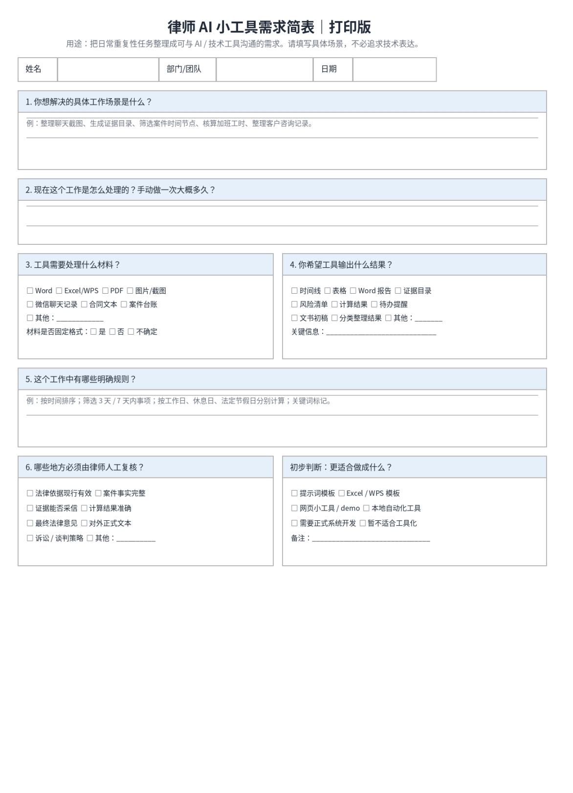

大家好，这里是一名正在观察大模型工具如何进入真实工作流的法学生赵怡彤。

过去一个月，我在律所做了一次很小的探索。我测试和观察法律垂类大模型工具，用 GPT、Codex 和一些现成工具搭了几个辅助律师工作的轻量 Demo，也开始准备一场面向律所的大模型工具使用培训。这不是行业报告，而是一份关于律所工作流工具化的早期观察笔记。

先澄清一个概念：本文讨论的不是某一个万能软件，而是一组进入法律工作场景的工具。它既包括已经产品化、能够服务检索和文书等场景的法律垂类大模型工具，也包括 GPT 这类通用大模型；还包括把 GPT、Codex、OCR、GitHub Pages 等组合起来，快速搭建轻量 Demo 的 vibe coding 实践。它们的能力、风险和适用位置并不相同，不能笼统地用一句“大模型行不行”概括。

这种区分看似只是名词问题，实际会影响讨论的起点。一个经过专业数据、检索链路和产品流程约束的法律垂类大模型工具，和一次随手打开 GPT 的对话，不应被当作同一种体验；一个用于验证需求的网页原型，也不等于可以直接进入真实案件的系统。

这一个月里，我越来越强烈地感到：AI 幻觉不只发生在模型里，也发生在人对 AI 的想象里。外部的人因为不了解律师工作，容易高估通用大模型；内部的人因为被低质量输出伤过，又可能低估整套工具链。这些工具真正进入律所，恰恰卡在两种幻觉之间。

## 大模型工具的双重幻觉：外部高估，内部低估

### 01 风很大，但我想知道它吹进律所以后还剩什么

我不是带着答案来的，而是带着问题来的。

互联网上关于大模型进入法律工作的讨论太多：法律大模型、Agent、知识库、vibe coding、skill、prompt、蒸馏、律所数字化革命……每个词都像一个风口，但放进律师每天的工作里，它们究竟能解决什么？

能不能让律师少做一点重复劳动？能不能让文件、证据、台账和时间线更清楚？能不能让年轻法律人更快理解业务？哪些环节可以交给工具，哪些环节必须由人承担？

一开始，我以为难点主要是工具选择：哪个模型更好，哪个软件更专业，prompt 怎样写得更准确，普通法学生能不能借助 GPT 和 Codex 做出一点有用的东西。真正进入律所后，我才发现，这些工具能否落地，更像是经验、流程和信任问题。工具本身只是最显眼的那一层。

### 02 对年轻法律人来说，成熟工具也许是一扇学习业务的窗

有一位有多年经验的法律前辈告诉我，现在一些成熟的法律垂类大模型工具，文书写作已经能够达到他相当高比例的要求，有时还会补充他一开始没有想到的视角。

这句话对我触动很大。我以前更习惯把大模型理解成“帮人生成内容的工具”，但对年轻法律人来说，较成熟的输出也可能成为一个反向学习业务的窗口。

真正有价值的用法，不是复制，而是拆解：它为什么这样组织事实？为什么补充这个角度？为什么这样排列请求？哪里给了我启发，哪里需要回到事实、法条和案例中核验？

把法律垂类大模型工具的输出当成一个可分析的样本，而不是标准答案，新人可能更快看见业务结构。对我而言，这比“替我写完一篇文书”更有学习价值。

### 03 第一站：把重复工作变成可讨论的原型

律师最值得从中被释放出来的，往往不是专业判断，而是围绕判断发生的大量机械劳动。

在访谈和观察律师需求后，我通过 vibe coding 做了几个轻量 Demo。它们不是成熟产品，也没有经过完整的安全、稳定性和真实案件验证；它们的作用，是先把律师口中的重复工作转换成可展示、可讨论、可修改的原型，让大家看到流程可能怎样被重新组织。

比如聊天记录和图片证据整理 Demo：先用 OCR 提取截图文字，再按时间、人物和事件归拢，形成事实节点与证据索引的初稿。它不判断证据效力，只是把零散材料整理到律师更容易判断的状态。

聊天截图经 OCR 提取并按时间线归拢后的事实节点（测试数据，非真实案件）

又比如加班工时和加班费核算 Demo：把工作日、休息日、法定节假日、调休规则、计算公式和依据放进同一套结构，输出可检查的核算草稿。再比如案件台账和时间线页面：把未来几天、几周的关键节点集中展示，减少在多个表格和文件之间来回寻找。

将节假日与调休规则结构化后生成的核算草稿（测试数据，非真实案件）

这些 Demo 背后的工具链并不神秘：GPT 帮我梳理需求和文本逻辑，Codex 协助生成和调整代码，OCR 负责从图片中提取文字，GitHub Pages 用来发布便于展示的网页原型。真正重要的不是叠了多少工具，而是律师能否看懂输入、过程和输出，并明确告诉我哪里不符合真实工作。

我逐渐意识到，律所工作流工具化最稳妥的起点，不一定是让工具直接给出漂亮结论，而是让混乱的材料、重复的计算和容易遗漏的节点先变得清楚。清晰本身就是效率。

轻量 Demo 还有一个好处：它允许需求尽早暴露错误，也让下一轮讨论更具体。与其花很长时间想象“律师可能需要什么”，不如先做出一个能点击、能输入、能看到结果的版本。律师一句“我们实际不会这样用”，往往比十页需求说明更有价值。

### 04 外部的幻觉：把律师想成文书输出机器

外部的人容易高估通用大模型，是因为他们低估了律师工作的复杂性。有些非法学背景的朋友会自然地把律师工作理解成：输入事实，查找法条，输出文书。按照这个模型，只要 GPT 能生成像样的法律文本，律师似乎就快被替代了。

但真实工作不是一条整齐的流水线。律师面对的是复杂的当事人、混乱的事实、不完整的证据、反复变化的沟通、客户预期、程序推进和职业责任。

比如，当事人发来一段 59 秒的语音：“他不讲理，那天晚上他明明答应了，后来又不认了。”这句话里没有规范的主体、时间、行为、证据和请求。它究竟指向合同违约、侵权，还是家庭纠纷？“答应”发生在什么场景，是否有录音或聊天记录，造成了什么后果，当事人真正希望得到什么？

通用大模型可以把语音转成文字、概括情绪，甚至列出若干案由；律师却要继续追问，把生活语言里的愤怒、委屈和碎片事实，翻译成可以被法律识别的问题，再判断证据与程序如何衔接。

所以，律师不是文本输出机器，而是把生活语言翻译成法律语言的人。文书是这场翻译之后的产物，不是法律服务的全部。

### 05 内部的创伤：被低质量输出伤过以后

很多律师并不是不了解大模型工具，而是被低质量输出伤过：胡编法条、引用废止规定、编造案例，或者结论语气笃定但依据错误。这样的警惕完全合理，法律工作不能只满足于“看起来像对的”。

工具进入律所，重点不是要求律师相信模型“以后不会错”，而是让错误有机会被看见：材料来自哪里，哪一步由模型生成，改动留下了什么痕迹，出现异常时可以回到哪里检查。可见的过程，比笼统的准确率更接近日常工作的安全感。

### 06 第一步，很多时候不是写代码，而是说清需求

我不是成熟律师，做 Demo 时必须依赖真实业务反馈：证据整理报告的格式是否顺手？核算页面里的依据是否可靠？案件台账更需要看板、时间线，还是提醒？这些问题只有真正做业务的人能校准。

为了减少来回解释，我把一句“这个工作很麻烦”拆成五个问题。它们不谈复杂技术，只帮助双方尽快确认：值不值得做、做到哪一步、交付什么，以及怎样检查。

#### 五个问题，把“很麻烦”拆成可沟通的需求

| 追问问题 | 想确认什么 | 例子 |
| --- | --- | --- |
| 1. 原始材料是什么？ | 这项工作的输入。 | 微信截图、OCR 文字、考勤 Excel、案件台账。 |
| 2. 现在怎么处理？一次多久？ | 是否真的值得工具化。 | 逐张排序截图、核对节假日、反复寻找关键节点。 |
| 3. 希望输出什么？ | 把“好用”变成可交付格式。 | Word 表格、时间轴、证据目录、核算草稿、提醒清单。 |
| 4. 哪一步不能交给工具？ | 划清自动化边界。 | 证据效力、法律结论、案件策略、客户承诺。 |
| 5. 最后怎样复核？ | 明确检查与责任落点。 | 核对事实节点、公式、依据和最终表达。 |

五个问题回答完，一个模糊抱怨通常就有了输入、流程、输出和边界，也更容易决定是否值得做成 Demo。

律所工作流工具需求简表：把模糊需求变成可讨论、可交付的流程

### 07 我夹在法律和技术中间，但价值也许就在中间

我既不是资深律师，也不是专业程序员，这曾让我不安。我的业务经验当然不如长期办案的律师，代码、部署、网页和脚本也大量借助 GPT、Codex 和现成工具完成。可这不意味着我只能站在两边之外。

我能听懂一些律师的问题，知道证据、文书、台账、当事人、程序和风险分别意味着什么；也能把模糊需求拆成输入、处理步骤、输出格式和复核节点，再借助大模型工具链做成看得见的流程。

我的中间价值，不是替代律师，也不是替代程序员，而是把律师听得懂的问题，翻译成工具可以执行的流程；再把结果放回律师可以复核的工作场景里。律师指出业务偏差，程序员处理更复杂的工程、安全和系统问题，我则让需求与原型之间少一些失真。

这种连接并不是“什么都会一点”的模糊位置。它需要把一句自然语言需求继续往下追：谁来输入，材料是否敏感，规则有没有地区差异，异常怎样处理，最终交给谁。也需要在 Demo 做出来后，把技术语言重新翻译回来，让律师不用理解代码，也能判断流程是否符合业务。

现在我判断一个场景是否适合引入工具，会先问：工作是否高频重复？主要消耗的是时间还是专业判断？输入和输出能否结构化？错误是否容易被发现和纠正？结果能否回到现有流程中使用？这几问比一句“大模型能不能做”更接近真实。

这一个月，我没有得出宏大结论。只是做了几次测试，问了一些具体问题，也搭了几个还很稚嫩的轻量 Demo。它们让我开始把一个巨大的风口，拆成真实的小问题：谁在为什么工作耗费时间，哪一步能被整理，哪一步需要经验，怎样让工具与责任各归其位。

感谢实习期间给予指点的前辈们。本文仅为个人观察，不代表任何机构立场。
